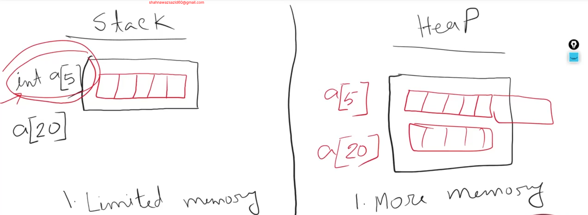
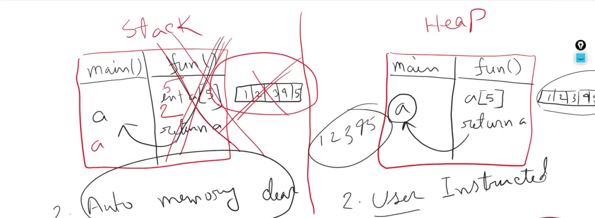

# W_1_M_2_DYNAMIC_MEMORY_ALLOCATION

- we will learn 
  1. SDynamic and Static Memory
  2. Dynamic Variable
  3. DYnamic Array
  4. Array REturn FRom Function 
  5. Dynamic Memory Deletion(to mke sure that app do not get slower)

## 2_1 static vs heap 

- `stack memory` is called stack memory/compile time memory and `heap memory` is called dynamic memory/run time memory 

- the difference between stack and heap
  1. Stack has limited memory Heap Has More Memory . In static memory if we declare a a fixed sized array like 5 it will adjust the  memory size by shrinking its size so this causes a problem like if we want to extend the size like size of the array will b e20 we cant do it in case of static memory but in case heap memory the memory does not gets shrink so there is extra space to redeclare and increase the size of the array. 
   
  

  2. as we already know the `stack memory` is the `compile time` memory. if we declare an function and and it deals with the array and returns the function, after the function works done the the array and the function gets popped off the stack and the array gets deleted (memory clear auto). On the other hand `heap memory` does not do the memory clear until the user gives instructions. we can say its user instructed. THis is the reason why after declaring the dynamic array we have to clear the memory after all the works done. 


  

## 2_2 lets see the declaration of dynamic variables 

```cpp
#include<bits/stdc++.h>
using namespace std;

int main(){
int x = 10; // it stores 4 byte space in stack memory
//  declare a dynamic variable
int *ptr = new int(20); // it stores 4 byte space in heap memory and returns the address of that memory location
cout << "Value of ptr: " << *ptr << endl; // output: 20
delete ptr; // free the dynamically allocated memory
return 0;
}
```

- now lets see how static variable deals with memory 

```cpp
#include<bits/stdc++.h>
using namespace std;

int *ptr; // global pointer variable, it will be stored in data segment of memory

void fun(){
int x = 10; // it stores 4 byte space in stack memory
ptr = &x; // assign the address of x to the global pointer variable ptr
cout << "Value of ptr: " << *ptr << endl; // output: 10
return;
}

int main(){
    fun(); // call the function to create a stack frame and allocate memory for x
    cout << "Value of ptr: " << *ptr << endl; // this will give garbage value because after the function popes off it forgets the values  
    return 0;
}
```

- now lets see how dynamic variable deals with memory ()

```cpp

#include<bits/stdc++.h>
using namespace std;

int *ptr; // global pointer variable, it will be stored in data segment of memory

void fun(){
int *x = new int(10); // it stores 4 byte space in heap memory
ptr = x; // assign the address of x to the global pointer variable ptr
cout << "Value of ptr: " << *ptr << endl; // output: 10
return;
}

int main(){
    fun(); // call the function to create a stack frame and allocate memory for x
    cout << "Value of ptr: " << *ptr << endl; // output: 10
    delete ptr; // deallocate the memory allocated in the heap
    return 0;
}
```